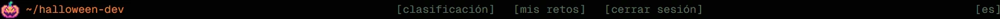
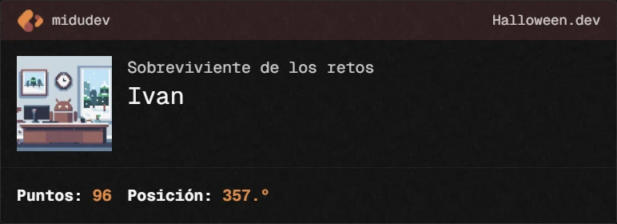
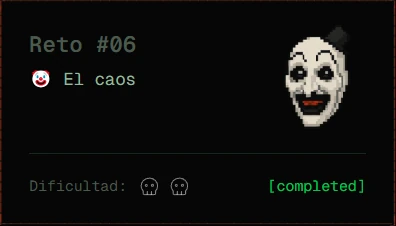

# Halloween.dev

Realizo los retos de **[halloween.dev](https://halloween.dev/)** (Retos de programación terroríficos) creados por [Miguel Ángel Durán _"midudev"_](https://midu.dev).

## Progreso

- 2025: 6 de 6
  

## Changelog

| Reto                                                                     | Dificultad                                                                       | Fecha resolución | Estado                                        |
| ------------------------------------------------------------------------ | -------------------------------------------------------------------------------- | ---------------- | --------------------------------------------- |
| [Reto #1](2025/01/index.ts): 👹 La posesión del código                   |                                          | 09 Nov 2025      |  |
| [Reto #2](2025/02/index.ts): 🐑 Cuenta las ovejas...                     |                                          | 12 Nov 2025      |  |
| [Reto #3](2025/03/index.ts): 🔪 Es viernes 13                            |                                          | 13 Nov 2025      |  |
| [Reto #4](2025/04/index.ts): Reto #4: 🔪 ¿Cuál es tu algoritmo favorito? |  | 14 Nov 2025      |  |
| [Reto #5](2025/05/index.ts): Reto #5: 🧩 Quiero jugar a un juego...      |  | 15 Nov 2025      |  |
| [Reto #6](2025/06/index.ts): Reto #6: 🤡 El caos                         |  | 15 Nov 2025      |  |
