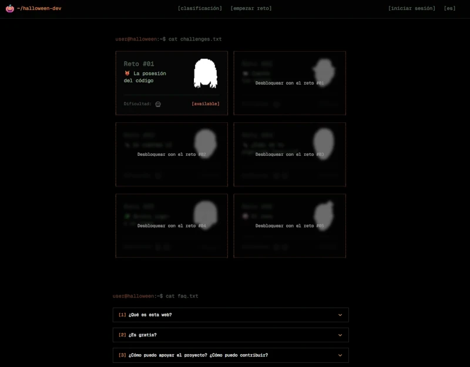
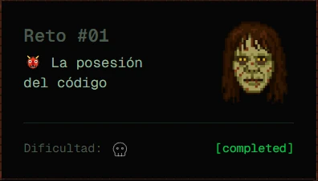
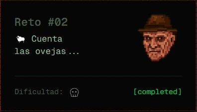
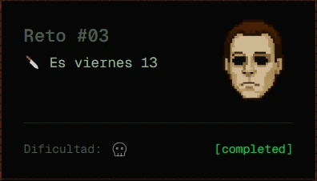
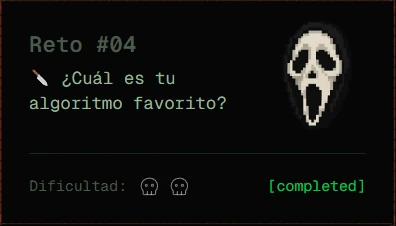
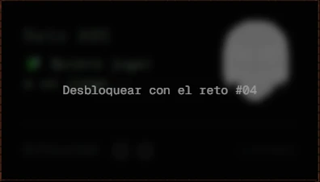
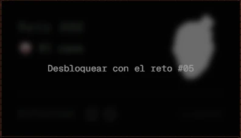

# Halloween

Realizo los retos de **[Halloween](https://halloween.dev/)** (Juego con retos de programación.) creados por [Miguel Ángel Durán _"midudev"_](https://midu.dev).

## Progreso

- 2025: 4 de 6

## Changelog

| Reto                                                                     | Dificultad                                                                       | Fecha resolución | Estado                                   |
| ------------------------------------------------------------------------ | -------------------------------------------------------------------------------- | ---------------- | ---------------------------------------- |
| [Reto #1](2025/01/index.ts): 👹 La posesión del código                   |                                          | 09 Nov 2025      |  |
| [Reto #2](2025/02/index.ts): 🐑 Cuenta las ovejas...                     |                                          | 12 Nov 2025      |  |
| [Reto #3](2025/03/index.ts): 🔪 Es viernes 13                            |                                          | 13 Nov 2025      |  |
| [Reto #4](2025/04/index.ts): Reto #4: 🔪 ¿Cuál es tu algoritmo favorito? |  | 14 Nov 2025      |  |
| Reto #5                                                                  |                                                                                  |                  |       |
| Reto #6                                                                  |                                                                                  |                  |       |
